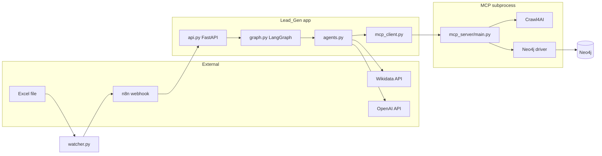

# Lead Intelligence (Lead_Gen)

End-to-end pipeline that turns **new leads** (company + domain or full URL) into a **Neo4j knowledge graph** with **structured triples**, **lexical chunks + embeddings**, **entity mentions**, and optional **Wikidata** enrichment. A **FastAPI** service exposes ingest and query; **LangGraph** orchestrates agents; an **MCP subprocess** runs **Crawl4AI** and **Neo4j** Cypher.

---

## Table of contents

1. [What this project does](#what-this-project-does)
2. [Architecture overview](#architecture-overview)
3. [Workflow, data flow, and control flow](#workflow-data-flow-and-control-flow)
4. [Python modules and how they link](#python-modules-and-how-they-link)
5. [How graph building works](#how-graph-building-works)
6. [Where LLMs are invoked](#where-llms-are-invoked)
7. [MCP server and Neo4j](#mcp-server-and-neo4j)
8. [Running locally](#running-locally)
9. [Neo4j exploration tips](#neo4j-exploration-tips)
10. [Extending the system](#extending-the-system)

---

## What this project does

- **Ingestion** (`POST /leads/ingest`): Crawl a URL (or `https://{domain}`), extract an `OrganizationGraph` via LLM, upsert **triples** into Neo4j, run **Wikidata linking** (parent/subsidiary from Wikidata), then **chunk** text, **embed** chunks, and link chunks to entities with **`MENTIONS`**.
- **Query** (`POST /leads/query`): Embed the question, **vector-search** chunks, **expand** through the entity graph, and run a **path search** strategy chosen by an LLM.
- **Optional Excel path**: `watcher.py` watches a spreadsheet and POSTs new rows to **n8n**, which can call the same FastAPI ingest endpoint.

---

## Architecture overview



---

## Workflow, data flow, and control flow

### 1) Lead capture (optional)

1. User adds a row to the watched Excel file (configured via `.env`: `file_to_watch`, `watch_dir`, `n8n_webhook`, `watcher_debounce_sec`).
2. `watcher.py` debounces saves, counts rows, and when a **new row** appears reads the last row.
3. Headers are mapped to `company_name` and `domain` when possible (`Organization`, `Company`, `Domain`, `Website`, etc.).
4. A JSON payload `{ "event": "new_lead", "lead": { ... } }` is POSTed to n8n.
5. n8n forwards `{ "company_name", "domain" }` to `POST /leads/ingest` (you configure the HTTP node).

### 2) API → LangGraph

- **`api.py`** builds a `LeadState` dict and calls `compiled_app.ainvoke(state)` from `graph.build_app()`.
- **Ingest**: `goal_type: "ingestion"`, plus `company_name`, `domain` (often a full `https://...` article URL).
- **Query**: `goal_type: "query"`, plus `question`.

### 3) LangGraph control flow (`graph.py`)

| Step | Node | Next |
|------|------|------|
| Entry | `planner` | Conditional on `goal_type` |
| Ingestion | `researcher` | `graph_architect` |
| Query | *(skip researcher)* | `graph_architect` |
| Terminal | `graph_architect` | `END` |

```text
ingestion:  planner → researcher → graph_architect → END
query:      planner → graph_architect → END
```

### 4) Data flow (ingestion)

1. **Researcher** calls MCP `web_crawl` with normalized URL. On HTTP **403**, falls back to MCP `web_search` (JSON payload may cause downstream “skip extraction” if it looks like search results only).
2. **Graph architect** receives `raw_web_content` (markdown/HTML).
3. HTML is stripped to **plain text**; length and “search JSON” heuristics decide whether to run **full LLM extraction** or a **minimal** org + Wikidata only.
4. **LLM** fills `OrganizationGraph` → **`organization_to_triples`** → MCP **`graph_upsert_triples`** → Neo4j nodes/relationships.
5. **`_apply_wikidata_linking`**: HTTP to Wikidata → MCP **`graph_apply_wikidata_linking`** → `Company` props + `HAS_PARENT_ORGANIZATION` / `HAS_SUBSIDIARY` where applicable.
6. **Chunking** + **OpenAI embeddings** + **`chunk_links`** (which entity names each chunk mentions) → MCP **`graph_upsert_document_chunks`** → `:Document`, `:Chunk`, `HAS_CHUNK`, `MENTIONS`, vector index.

### 5) Data flow (query)

1. Embed `company_name` + `question`.
2. MCP **`graph_vector_search_chunks`** → top-K chunks.
3. MCP **`graph_expand_from_chunks`** → entities + neighbor chunks.
4. LLM picks **`shortest_path`** vs **`shared_board_members`**.
5. MCP **`graph_search_paths`** → path results returned to API.

---

## Python modules and how they link

| File | Role |
|------|------|
| **`api.py`** | FastAPI app: `POST /leads/ingest`, `POST /leads/query`; loads `.env`; invokes LangGraph; shapes JSON responses (`skipped_extraction`, `cleaned_content`, `crawl_error`, `state`, retrieval fields). |
| **`graph.py`** | Builds and compiles the LangGraph `StateGraph`: nodes `planner`, `researcher`, `graph_architect`; routing by `goal_type`. |
| **`state.py`** | `LeadState` TypedDict: identifiers, crawl text, chunk/debug fields, `graph_report`, `wikidata_enrichment`, errors. |
| **`agents.py`** | All agent logic: planner, researcher (crawl/search via MCP), graph architect (extract, triples, Wikidata, chunks, embeddings, query retrieval); OpenAI chat + embeddings; Wikidata HTTP; helpers (`_html_to_plain_text`, `_chunk_text`, `_entity_mentioned_in_chunk`, etc.). Imports `LeadState`, `call_mcp_tool`, `graph_models`. |
| **`graph_models.py`** | Pydantic models: `OrganizationGraph`, `Location`, `Person`, `Product`, … — the **schema** the extraction LLM must populate (includes `major_customers`, `key_suppliers`, partners, competitors, etc.). |
| **`mcp_client.py`** | `call_mcp_tool(name, args)`: spawns `python -m mcp_server.main <tool> -` with **JSON on stdin** (avoids argv size limits for large embedding payloads). |
| **`mcp_server/main.py`** | MCP-style tool server: Crawl4AI crawl, stub search, Neo4j upserts (triples, chunks, vector search, expansion, path search, Wikidata linking). CLI entrypoint for subprocess use. |
| **`watcher.py`** | Standalone: watchdog on Excel; optional normalization to `{company_name, domain}`; POST to n8n. Not imported by the API. |

**Dependency direction (simplified):**

`api.py` → `graph.py` → `agents.py` → (`state.py`, `graph_models.py`, `mcp_client.py`) → subprocess `mcp_server.main`

---

## How graph building works

### A) From page text to a structured graph (LLM)

The graph architect converts crawl output to plain text, then calls OpenAI with a **strict JSON schema** derived from `OrganizationGraph.model_json_schema()` (normalized by `_openai_schema` for OpenAI).

Essential idea:

- **System prompt**: extract only what is stated; populate `major_customers` / `key_suppliers` when the text clearly names buyers or suppliers.
- **User prompt**: first ~8000 characters of cleaned plain text.

The validated JSON becomes a Pydantic `OrganizationGraph`, then **`organization_to_triples(org)`** produces a list of `Triple` objects (`subject`, `predicate`, `object`, `type` for Neo4j rel type, `subject_label` / `object_label` for node labels).

Example patterns:

- Attributes often use **`object_label="Literal"`** so values like descriptions become `(:Literal {name: "..."})` linked from `(:Company)`.
- Inter-company relations use **`object_label="Company"`** with types such as `HAS_SUBSIDIARY`, `PARTNERS_WITH`, `COMPETES_AGAINST`, `HAS_MAJOR_CUSTOMER`, `HAS_SUPPLIER`.

### B) Triples → Neo4j (MCP)

`graph_upsert_triples` runs, for each triple, Cypher of the form:

```cypher
MERGE (s:SubjectLabel {name: $subject})
MERGE (o:ObjectLabel {name: $object})
MERGE (s)-[r:REL_TYPE {predicate: $predicate}]->(o)
```

So **every triple** becomes two nodes (by `name` + label) and one relationship. Duplicate names with the same label **merge** to the same node.

### C) Wikidata enrichment (after triples)

`_wikidata_enrich_company` calls Wikidata (`wbsearchentities`, `wbgetentities`), reads **P749** (parent) and **P355** (subsidiary), then `call_mcp_tool("graph_apply_wikidata_linking", payload)` sets `wikidata_*` properties on the anchor `Company` and merges related `Company` nodes by `wikidata_id` where configured.

This does **not** automatically add arbitrary supply-chain edges unless you extend which Wikidata properties you import.

### D) Lexical layer: documents, chunks, embeddings, MENTIONS

1. **Chunk** plain text (character windows with overlap).
2. **Embed** each chunk with `text-embedding-3-small`.
3. Build **`entity_names`** from triple subjects/objects plus the ingest **`company_name`** (anchor).
4. For each chunk, **`_entity_mentioned_in_chunk`** decides if the chunk text refers to each entity (handles e.g. “Apple” vs “Apple Inc.”).
5. **`graph_upsert_document_chunks`** creates/updates `:Document` and `:Chunk`, `(:Document)-[:HAS_CHUNK]->(:Chunk)`, stores `embedding`, ensures vector index, then:

```cypher
MATCH (c:Chunk {chunk_id: row.chunk_id})
UNWIND row.mention_names AS nm
MATCH (e {name: nm})
MERGE (c)-[:MENTIONS]->(e)
```

So chunks connect to **any** node that already has matching `name` (e.g. `Company`, `Person`, …).

Together, **structured triples** + **MENTIONS** explain graphs like Apple and TSMC linked through shared chunks and explicit `HAS_MAJOR_CUSTOMER`-style edges when the extractor fills those fields.

---

## Where LLMs are invoked

| Location | Model (typical) | Purpose |
|----------|-----------------|---------|
| `planner_agent` | `gpt-4o-mini` | Structured plan JSON (`PlanOutput`). |
| `graph_architect_agent` (ingest) | `gpt-4o-mini` | Extract `OrganizationGraph` from text (`response_format` JSON schema). |
| `graph_architect_agent` (query) | `gpt-4o-mini` | Choose graph search strategy (`shortest_path` vs `shared_board_members`). |
| `_embed_texts_openai` | `text-embedding-3-small` | Chunk embeddings and query embedding. |

The **researcher** no longer uses an LLM to pick tools; it always tries **`web_crawl`** first (then search only on 403).

---

## MCP server and Neo4j

### How MCP is invoked

`mcp_client.call_mcp_tool` runs:

```bash
python -m mcp_server.main <TOOL_NAME> -
```

with **JSON arguments on stdin**. Stdout must be a single JSON object (Crawl4AI logging is redirected to stderr in `main()` so it does not break parsing).

### Tools exposed (`TOOL_REGISTRY` in `mcp_server/main.py`)

| Tool | Purpose |
|------|---------|
| `web_crawl` | Crawl4AI: fetch URL → `markdown` / `cleaned_html` / `html`. |
| `web_search` | Placeholder structured response (extend with a real search API if needed). |
| `graph_upsert_triples` | MERGE nodes/relationships from triple list. |
| `graph_upsert_document_chunks` | Document + chunks + embeddings + `MENTIONS`. |
| `graph_vector_search_chunks` | Vector index query over `Chunk.embedding`. |
| `graph_expand_from_chunks` | Chunks → entities → graph expansion → more chunks. |
| `graph_search_paths` | Shortest path or shared board pattern between two companies. |
| `graph_apply_wikidata_linking` | Apply Wikidata id and parent/subsidiary edges. |

### Neo4j configuration

Environment variables (defaults in code): `NEO4J_URI`, `NEO4J_USER`, `NEO4J_PASSWORD`.

---

## Running locally

1. **Python env**: Create a venv and install dependencies (FastAPI, uvicorn, langgraph, openai, httpx, pydantic, neo4j driver, crawl4ai, etc.—match your environment).
2. **`.env`**: `OPENAI_API_KEY`, Neo4j vars, optional watcher/n8n vars.
3. **Neo4j**: Running and reachable; vector index for chunks is created by the MCP tool when ingesting.
4. **API**:

   ```bash
   uvicorn api:app --host 0.0.0.0 --port 8000 --reload
   ```

5. **Ingest example** (full article URL recommended):

   ```json
   POST /leads/ingest
   { "company_name": "TSMC", "domain": "https://en.wikipedia.org/wiki/TSMC" }
   ```

6. **Query example**:

   ```json
   POST /leads/query
   { "company_name": "Apple", "domain": "https://apple.com", "question": "Who are key suppliers mentioned?" }
   ```

7. **Watcher** (optional): `python watcher.py` with `file_to_watch`, `watch_dir`, `n8n_webhook` set.

---

## Neo4j exploration tips

- **Avoid** `MATCH (n) RETURN n LIMIT 5000` for exploration; use anchored patterns (e.g. `Company` + 1–2 hops).
- **Shared chunks** between two companies:

  ```cypher
  MATCH (a:Company) WHERE toLower(a.name) CONTAINS 'apple'
  MATCH (b:Company) WHERE toLower(b.name) CONTAINS 'tsmc'
         OR toLower(b.name) CONTAINS 'taiwan semiconductor'
  MATCH p = (a)<-[:MENTIONS]-(ch:Chunk)-[:MENTIONS]->(b)
  OPTIONAL MATCH (d:Document)-[:HAS_CHUNK]->(ch)
  RETURN p, d
  LIMIT 25;
  ```

- **Graph view**: Return `p` (path) or nodes/relationships so Neo4j Browser can render the graph panel.

---

## Extending the system

- **New relation types from text**: Add fields to `OrganizationGraph`, map them in `organization_to_triples`, and document them in the extraction system prompt.
- **New Wikidata relations**: Extend `_wikidata_enrich_company` and `graph_apply_wikidata_linking` with additional P-ids and rel types.
- **Better search fallback**: Implement a real `web_search` in `mcp_server/main.py`, or concatenate snippets into plain text before extraction (careful with quality).
- **Entity deduplication**: “Apple” vs “Apple Inc.” still create separate nodes unless you add canonicalization or merge rules.

---
